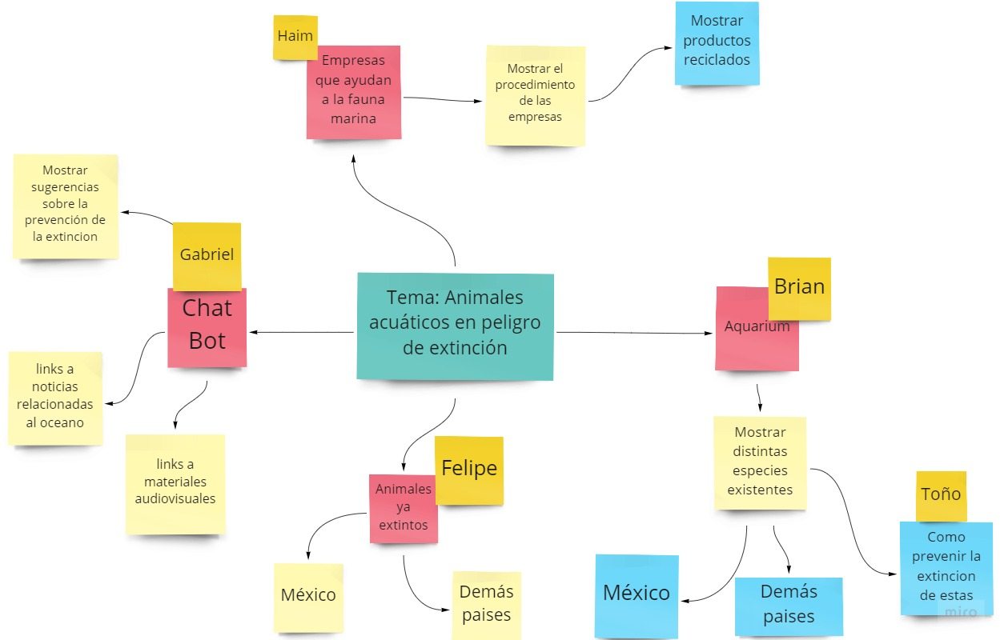
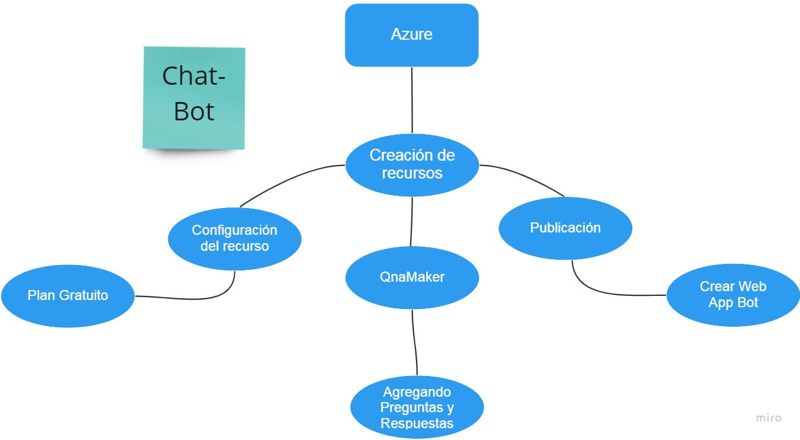

# HACKATON---HACK-THE-OCEAN
Repositorio con la solución del hackaton

| Proyecto | Práctica | Link al repo |
| ------------- |:-------------:| -----:|
|`Toma de requerimientos`|1|Archivos adjuntos en este repo|
|`Webpage`|2|[Link al repo](https://github.com/BrianOrihuelaP/Hackaton-Web-Page)|

## Pasos en la elaboracion del proyecto:

1. Identificar Problematica.
2. Propuesta de solucion.
3. Levantamiento de requerimientos
4. Herramientas a utilizar
5. Desarrollo de pagina web.
6. Proyecto Finalizado con problematica y propuesta de solucion.

### 1.Identificación de Problema.

* En nuestro Caso decidimos enfocarnos en los animales marinos en peligro de extincion, investigamos acerca de esta problematica y nuestra sorpresa es que casi no hay sitios web que se enfoquen en este problema y den la suficiente informacion para poder hacer algo al respecto.
> Sabemos que este no es el unico problema que presenta el oceano.

>Foto de Wexor Tmg en Unsplash

### 2.Propuesta de solución.

* Crear una pagina web con toda la informacion respecto a los animales marinos que se encuentren en peligro de extincion al igual que los animales marinos que se extinguieron, pero no solo es una pagina web con puro texto que ni siquiera te tomarias el tiempo en leer, se construira con informacion relevante que vaya al grano sin tantos rodeos.
* contara con un diseño llamativo y sencilla de navegar en ella para que todas las personas puedan utilizar, ademas de contar con un chat que te puede ayudar con algunas preguntas y/o dudas que tengas al respecto.

### 3.Levantamiento de requerimientos.

### 4.Herramientas a utilizar

* Azure: para la creacion del chat.
* Git: para versionar el proyecto.
* Github: para el despliegue de la pagina.
* Miro: para el analisis del problema.
* Node Js: para la maquetacion de la pagina web.
* Jest Js: para realizar las pruebas de la pagina web.
* Palette Coloors: para el diseño de la pagina web.
* VsCode: Donde se introdujo el codigo que llevaria la pagina web.

### 5.Desarrollo de la Pagina web.

1. Lo primero fue la creacion de un proyecto y agregando las dependencias que se utilizaran en dicho proyecto.
> ***npm init*** es para inicializar el proyecto y crear un archivo json en nuestro proyecto.
> 
> ***npm install --save-dev jest*** con este comando se agrega la dependencia Jest, nos ayudara para poder realizar las pruebas de unidad del proyecto.

2. Estructura de la Pagina Web

3. Creando las pruebas de unidad del proyecto.

4. Creacion del Chat-Bot.

* Gracias a la ayuda de ***Azure*** pudimos crear un chatbot con mucha facilidad.
* Lo primero fue la creacion del recurso que utilizaremos y nombrar nuestro chatbot.
* Despues nos redireccionamos a otra pagina de azure donde se encuentra ya creado nuestro recurso pero esta vacio, entonces agregaremos nuestra preguntas que se nos ocurrieron las personas podrian hacerle, y tambien le introdujimos las respuestas a dichas preguntas.
* Al finalizar de agregar las preguntas y respuestas necesitamos publicar dicho servicio y crear una web app para consultar el codigo de dicho chatbot para poder colocarlo en nuestra pagina web.

